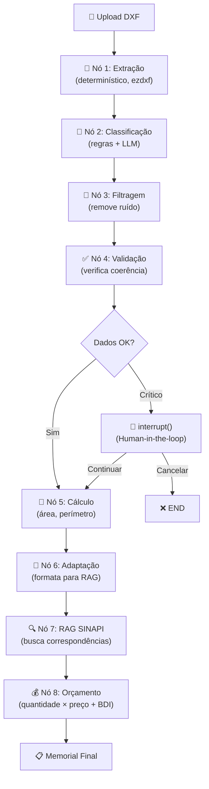

# Blueprint Backend — Módulo de IA

Pipeline inteligente para extração de dados DXF e geração de orçamentos SINAPI, orquestrado via **LangGraph**.

## Arquitetura

```
DXF → Extração DETERMINÍSTICA (ezdxf, sem IA) → Dados brutos
    → Pipeline LangGraph (IA para CLASSIFICAR e LIMPAR) → Dados limpos
    → RAG SINAPI → Orçamento Final
```

### Princípio Fundamental

**A IA NÃO extrai geometria do DXF** — isso é trabalho determinístico do `ezdxf`.

A IA é usada para:
1. **Classificar** layers ambíguas (layer "0", nomes não-padrão)
2. **Filtrar** ruído (anotações, cotas, hachuras)
3. **Validar** coerência (um "pilar" com 500m² provavelmente é laje)
4. **Buscar** correspondências SINAPI via RAG

## Estrutura de Pastas

```
apps/projetos/ai/
├── config.py                    # Config centralizada (.env, LangSmith)
├── client.py                    # Cliente LLM (ChatOllama com cache)
├── prompts.py                   # Templates de prompts
│
├── extraction/                  # Extração determinística (sem IA)
│   ├── __init__.py
│   ├── dxf_reader.py           # Leitura ezdxf com filtros inteligentes
│   ├── geometry.py             # Cálculos geométricos (Shoelace, perímetro)
│   ├── filters.py              # Regras de filtragem (tipo + layer)
│   └── geojson_builder.py      # Monta GeoJSON limpo
│
├── classification/              # Classificação inteligente
│   ├── __init__.py
│   ├── layer_classifier.py     # 2 estágios: regras → LLM
│   └── taxonomy.py             # Taxonomia de elementos + mapeamento SINAPI
│
├── graph/                       # Orquestração LangGraph
│   ├── __init__.py
│   ├── state.py                # BlueprintState (TypedDict)
│   ├── nodes.py                # 8 nós com @traceable (LangSmith)
│   ├── edges.py                # Roteamento condicional
│   └── builder.py              # Monta grafo com MemorySaver (HITL)
│
├── rag/                         # Retrieval-Augmented Generation
│   ├── documents.py            # Documentos SINAPI → Document objects
│   ├── embeddings.py           # Fábrica de embeddings
│   ├── vectorstore.py          # ChromaDB (persistência, busca)
│   └── retriever.py            # Interface de recuperação
│
└── services/                    # Camada de aplicação
    ├── pipeline_service.py     # Interface pública (invoke + retomar HITL)
    └── orcamento_service.py    # RAG + cálculo de orçamento final
```

## Fluxo do Grafo LangGraph



## Features

### 🔧 Extração Determinística
- Filtragem por **tipo de entidade** (ignora DIMENSION, HATCH, TEXT, etc.)
- Filtragem por **layer** (ignora COTAS, CARIMBO, TEXTOS, etc.)
- Suporte a LWPOLYLINE, POLYLINE, LINE, ARC, CIRCLE, SPLINE, ELLIPSE

### 🤖 Classificação Inteligente
- **Estágio 1**: Regras determinísticas com 50+ mapeamentos de layers
- **Estágio 2**: LLM (Ollama) para layers que as regras não classificam
- Taxonomia: pilar, viga, laje, estaca, fundação, parede, tubulação, elétrica, anotação

### 👤 Human-in-the-Loop
- Usa `interrupt()` nativo do LangGraph para pausar em alertas críticos
- Pipeline retomável via endpoint `POST /api/projetos/<id>/retomar/`
- Checkpointer `MemorySaver` mantém estado entre pausas

### 📊 Observabilidade (LangSmith)
- Todos os 8 nós decorados com `@traceable`
- Tracing automático via `LANGSMITH_TRACING=true` no `.env`
- Cada nó aparece como um "run" no dashboard LangSmith

### 💰 RAG SINAPI
- Busca semântica via ChromaDB + sentence-transformers
- Mapeamento automático categoria → descrição SINAPI
- Cálculo de orçamento com BDI configurável por projeto

## Endpoints API

| Método | Endpoint | Descrição |
|--------|----------|-----------|
| POST | `/api/projetos/<id>/upload/` | Upload DXF → pipeline completo |
| POST | `/api/projetos/<id>/retomar/` | Retoma pipeline pausado (HITL) |
| GET | `/api/projetos/<id>/itens/` | Lista itens do projeto |

### Exemplo: Retomar pipeline

```json
POST /api/projetos/1/retomar/
{
    "thread_id": "abc123-...",
    "decisao": "continuar"
}
```